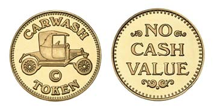
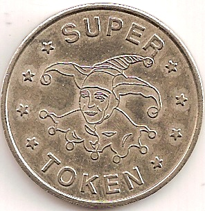

# Chapter 10: Tokens

---
# Token

_Derived from the Old English word "tācen," meaning a sign or symbol_

Privately issued coin-like items of _insignificant intrinsic value_

**e.g.** transport tokens, laundry tokens, arcade game tokens, etc...

---
# Blockchain Tokens

Redefining the word "Token" to mean:

_abstractions that can be owned; representing assets, currency, or access rights_

Restrictions on use and ownership are gone, making the "insignificant value" expectation a thing of the past

---
# Token Usage

Usage | Description
--- | ---
`Currency` | value determined through private trade
`Resource` | resource earned or produced in a sharing economy or resource-sharing environment; for example, a storage or CPU token representing resources that can be shared over a network
`Asset` | ownership of an intrinsic or extrinsic, tangible or intangible asset; for example, gold, real estate, a car, oil, energy, MMOG items, etc...
`Access` | access rights and grant access to a digital or physical property, such as a discussion forum, an exclusive website, a hotel room, or a rental car
`Equity` | shareholder equity in a digital organization (e.g., a DAO) or legal entity (e.g., a corporation)
`Voting` | voting rights in a digital or legal system
`Collectible` | digital collectible (e.g., CryptoPunks) or physical collectible (e.g., a painting)
`Identity` | digital identity (e.g., avatar) or legal identity (e.g., national ID)
`Attestation` | certification or attestation of fact by some authority or by a decentralized reputation system (e.g., marriage record, birth certificate, college degree)
`Utility` | access or pay for a service

---
# Fungibility
Definition: _Goods or commodity, where individual units are interchangeable_

## Fungible Tokens
Any single unit of the token can be substituted for another without any difference in its value or function

## Non-Fungible Tokens
Represent a unique tangible or intangible item and therefore are not interchangeable

(i.e. represents ownership of a _specific_ Van Gogh painting)

---
# Counterparty Risk
_The risk that the **other party** in a transaction will fail to meet their obligations_

Someone holds the physical asset; by necessity they become party to the fulfillment of the transaction and add counterparty risk to any transaction involving that asset

For items such as a certificate, deed, title, or digital token:
- Do they have the asset?
- Will they recognize / allow transfer of ownership based on token transfer? 

It is important to understand who holds the asset represented by the token, and what rules apply to that underlying asset

---
# Tokens & Intrinsicality
_The word "intrinsic" derives from the Latin "intra," meaning "from within."_

## Intrinsic Representation
Digital items that are intrinsic to the blockchain. Assets are governed by consensus rules, just like the tokens themselves

## Extrinsic Representation
Representation of extrinsic things; real estate, corporate voting shares, trademarks, gold bars, etc... carry additional _counterparty risk_

They are held by custodians, recorded in external registries, or controlled by laws and policies outside the blockchain environment

---
# Utility or Equity?
Most projects use tokens in one of two ways: as _utility tokens_ or as _equity tokens_

## Utility Tokens
Required to gain access to a service, application, or resource

## Equity Tokens
Represent shares in the control or ownership of something, such as a startup.

Equity tokens can be as limited as non-voting shares for distribution of dividends and profits, or as expansive as voting shares in a DAO

---
# Why Utility Tokens?
- tokens are a great fundraising mechanism
- offering **equity** to the public is regulated in most countries
- many startups hope to get around regulatory restrictions by _disguising equity tokens as utility tokens_

⚠️ disguised offerings are likely to be seen in future as an attempt to deceive the public (by regulators)

## The Problem
Utility tokens introduce significant risks and adoption barriers for startups

---
_"When you add a utility token to your platform, but the token can only be used on your single platform with a small market, you are recreating the conditions that made physical tokens worthless"_

---
# Token Checklist
1. Adopt a token because your application cannot work without a token
1. Adopt it because the token lifts a fundamental market barrier or solves an access problem
3. Don’t introduce a utility token because it is the only way you can raise money fast and you need to pretend it’s not a public securities offering

---
# Tokens on Ethereum

To create a new token on Ethereum, you must create a new smart contract.

Once deployed, the smart contract handles everything, including ownership, transfers, and access rights

---
# ERC20: Fungible Tokens
A standard for fungible tokens, meaning that different units of an ERC20 token are interchangeable and have no unique properties

---
# ERC223: Token / Contract Interface Standard
The ERC223 proposal attempts to solve the problem of inadvertent transfer of tokens to a contract (that may or may not support tokens) by detecting whether the destination address is a contract or not

---
# ERC777: Token / Contract Interface Standard

---
# ERC721: Non-fungible Token (Deed) Standard
Non-fungible tokens track ownership of a unique thing

The thing owned can be a digital item, such as an in-game item or digital collectible; or the thing can be a physical item whose ownership is tracked by a token, such as a house, a car, or an artwork

Deeds can also represent things with negative value, such as loans (debt), liens, easements, etc...

---

# Using Token Standards
The primary purpose of these standards is to encourage interoperability between contracts

Wallets, exchanges, user interfaces, and other infrastructure components can interface in a predictable manner with any contract that follows the specification

To be compliantwith ERC20, you need to at minimum implement the functions and behavior specified by the ERC20 standard

---

# Extensions to Token Interface Standards
Extension | Description
--- | ---
`Owner control` | The ability to give specific addresses, or sets of addresses (i.e., multisignature schemes), special capabilities, such as blacklisting, whitelisting, minting, recovery, etc.
`Burning` | The ability to deliberately destroy (“burn”) tokens by transferring them to an unspendable address or by erasing a balance and reducing the supply.
`Minting` | The ability to add to the total supply of tokens, at a predictable rate or by "fiat" of the creator of the token.
`Crowdfunding` | The ability to offer tokens for sale, for example through an auction, market sale, reverse auction, etc.
`Caps` | The ability to set predefined and immutable limits on the total supply (the opposite of the "minting" feature).
`Recovery backdoors` | Functions to recover funds, reverse transfers, or dismantle the token that can be activated by a designated address or set of addresses.
`Whitelisting` | The ability to restrict actions (such as token transfers) to specific addresses. Most commonly used to offer tokens to "accredited investors" after vetting by the rules of different jurisdictions. There is usually a mechanism for updating the whitelist.
`Blacklisting` | The ability to restrict token transfers by disallowing specific addresses. There is usually a function for updating the blacklist.
---

# Tokens & ICOs
As in any early-stage technology, the first wave of products and companies will almost all fail, and some will fail spectacularly

Many of the tokens on offer in Ethereum today are barely disguised scams, pyramid schemes, and money grabs

---

